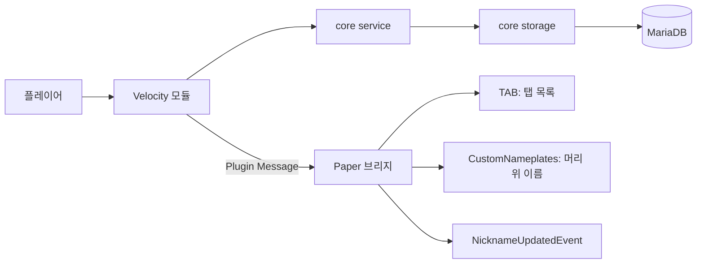

# CustomNickname 설계

## 책임 경계

| 모듈 | 책임 | 직접 알면 안 되는 것 |
|---|---|---|
| `core/api` | 외부 플러그인이 사용하는 조회·변경 계약과 값 객체 | Velocity·Paper 구현 세부 사항 |
| `core/service` | 입력 규칙, 비동기 실행, revision 캐시, 변경 후 알림 | JDBC 문장, Bukkit 객체 |
| `core/storage` | MariaDB 테이블, 트랜잭션, 토큰 해시, 이력 | 명령어·인벤토리·표시 UI |
| `core/storage/sql` | JDBC SQLState와 MariaDB 오류 코드의 분류 | 닉네임 정책 |
| `core/storage/error` | 안전한 운영·사용자 메시지를 가진 DB 오류 타입 | SQL 문장과 비밀번호 |
| `core/protocol` | Velocity↔Paper의 버전 있는 plugin message 인코딩 | DB 연결·게임 API |
| `velocity` | 접속 동기화, MariaDB 시작, 명령어, TAB, Paper 전파 | Paper 인벤토리 구현 |
| `paper-bridge` | PDC 변경권 아이템, 표시명, CustomNameplates, 로컬 이벤트 | MariaDB 직접 접속 |

`core`는 Java 라이브러리다. Paper·Velocity API 타입을 `core`에 추가하지 않는다. 새 플랫폼 기능은 해당 플랫폼 모듈에 어댑터로 두고, 공통 계약이 필요할 때만 `api`에 최소한의 값 객체나 인터페이스를 추가한다.

## 데이터 흐름

Velocity가 닉네임 원본이다. Paper 브리지는 받은 revision보다 낮은 프로필을 적용하지 않으며 MariaDB에 연결하지 않는다. TAB 갱신이 1순위, CustomNameplates가 2순위, Bukkit `displayName`과 `NicknameUpdatedEvent`가 그 뒤를 따른다.

## 변경권 상태와 원자성

Paper 아이템에는 `customnickname:ticket_id` UUID만 넣는다. MariaDB에는 이 UUID의 SHA-256 해시만 저장한다. `ISSUED` 티켓을 사용할 때 `cn_players` 잠금, 티켓 `USED` 전환, 프로필 수정, 닉네임 이력, 감사 로그를 하나의 트랜잭션으로 commit한다. 같은 UUID를 복제한 아이템은 하나가 사용된 뒤 모두 `USED`로 판정되어 Paper 인벤토리에서 제거된다.

## SQL 오류 처리

`SqlErrorTranslator`가 JDBC 오류를 다음 예외로 바꾼다.

| 조건 | 예외 | 운영 처리 |
|---|---|---|
| SQLState `28000`, MariaDB 1044/1045 | `DatabaseAuthenticationException` | DB 사용자·비밀번호·권한 확인 |
| SQLState `08xxx` | `DatabaseUnavailableException` | DB 호스트·포트·서버 상태 확인 후 재시도 |
| SQLState `40001`, 1205, 1213 | `DatabaseTransactionException` | 저장소가 두 번 재시도, 이후 사용자에게 재시도 안내 |
| SQLState `23xxx`, 1062 | `DatabaseConstraintException` | 닉네임 중복 또는 요청 중복 처리 |
| SQLState `42xxx`, `3D000`, 1146 | `DatabaseSchemaException` | 스키마 생성 권한·테이블 상태 확인 |

예외 메시지에는 비밀번호나 SQL 문장을 넣지 않는다. 원본 `SQLException`은 cause로 남아 Velocity 로그에서 SQLState와 vendor code를 확인할 수 있다.

## 표시 플러그인 reload

TAB과 CustomNameplates placeholder는 1초 주기로 갱신한다. 닉네임 변경 때는 즉시 한 번 갱신한다. reload 시에는 기존 placeholder를 찾은 경우에만 해제하고 다시 등록한다. 캐시에 프로필이 없을 때는 placeholder 원문 대신 실제 계정명을 반환한다.

## 빌드와 배치

`mvn package`는 테스트를 실행하고 다음 JAR를 자동 복사한다.

| 산출물 | 배치 위치 |
|---|---|
| `custom-nickname-velocity-*.jar` | `../Proxy/plugins` |
| `custom-nickname-paper-bridge-*.jar` | `../lobby/plugins` |

실행 중인 서버는 JAR를 교체한 것만으로 코드를 읽지 않는다. 각 서버를 안전하게 재시작한 뒤 로그에서 플러그인 시작 성공을 확인한다.
