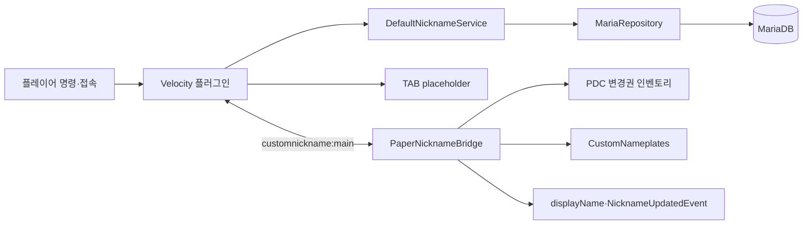

# CustomNickname 2

## 문서 위치와 개발 정보

이 문서는 **소스 저장소 `custom-nickname/`의 루트**에 있습니다. 서버가 생성하는 `Proxy/plugins/customnickname/`와 `lobby/plugins/CustomNicknameBridge/`는 실행 설정 폴더입니다. 소스 문서는 실행 설정 폴더에 자동 복사되지 않습니다.

| 문서 | 내용 |
|---|---|
| [DESIGN.md](DESIGN.md) | 모듈 책임, DB와 메시지 경계, 실패 처리 및 설계 제약 |
| [Agents.md](Agents.md) | 수정 전 Proxy·lobby 로그 확인, 코딩·검증 규칙 |
| [전환 계획](VELOCITY_MIGRATION_PLAN.md) | 초기 요구 사항과 목표 설계 |
| [검토 질문](VELOCITY_MIGRATION_PLAN_QUESTIONS.md) | 변경권 복구와 화면 갱신에 관한 검토 항목 |

파일 이름은 정확히 `DESIGN.md`, `Agents.md`입니다. 대소문자를 구분하는 환경에서 `AGENT.md`나 `agents.md`와는 다릅니다. 계획 문서의 목표와 현재 구현이 다른 부분은 아래 구현 한계를 참고하세요.

| 항목 | 확인 가능한 표기 |
|---|---|
| 저장소 소유 조직 | [astatine-mc](https://github.com/astatine-mc) |
| 소스 저장소 | [astatine-mc/custom-nickname](https://github.com/astatine-mc/custom-nickname) |
| 플러그인 개발자 표기 | **Seremc** — Velocity `@Plugin.authors` 및 Paper `plugin.yml`의 현재 작성자 값 |
| 구현 지원 | 이 작업 대화에서 OpenAI Codex가 코드 작성·수정과 문서화를 지원 |
| 개인 개발자 실명·연락처 | 별도 제공되지 않았으므로 기재하지 않음 |

Git 커밋 작성자 설정은 플러그인 개발자 신원과 동일하다고 간주하지 않습니다. 공식 개인 개발자 표기가 정해지면 두 플러그인 메타데이터와 이 표를 함께 수정해야 합니다.

## 현재 시스템 구조

```text
projectA/
├── custom-nickname/              소스 저장소
│   ├── README.md / DESIGN.md / Agents.md
│   ├── core/                    API, 정책, 프로토콜, MariaDB 저장소
│   ├── velocity/                프록시 플러그인
│   └── paper-bridge/            백엔드 표시·아이템 브리지
├── Proxy/plugins/               Velocity JAR와 실행 설정
└── lobby/plugins/               Paper 브리지 JAR와 실행 설정
```



Maven 배포 모듈은 세 개입니다. `core` 안의 api/service/storage/protocol은 Java 패키지 경계이며 독립 배포 JAR 모듈로 각각 분리한 구조는 아닙니다. 서비스는 현재 `MariaRepository` 구체 클래스에 의존합니다.

| 코드 | 수행하는 일 |
|---|---|
| `NicknameService`·프로필 DTO | 비동기 조회·변경 계약과 UUID 중심 데이터 전달 |
| `NamePolicy` | NFC 정규화, 문자·길이·금지어 검증 |
| `DefaultNicknameService` | DB 작업 큐, UUID 캐시, 변경 콜백 |
| `MariaRepository` | 스키마 생성, 잠금·commit·rollback, 이력과 토큰 해시 |
| `SqlErrorTranslator`·DB 예외 | JDBC 오류 분류와 공통 안내문 |
| `NicknameProtocol` | 버전·UUID·길이 제한이 있는 바이너리 메시지 |
| `VelocityNicknamePlugin` | 초기화, 접속, 서버 이동, 메시지 검증과 전달 |
| `VelocityCommands`·`TabIntegration` | 권한 있는 명령 처리와 TAB 표시 |
| `PaperNicknameBridge`·`TicketItems` | 수신 프로필 적용과 실제 아이템 검사·제거 |
| `CustomNameplatesIntegration` | 선택 플러그인 API 반사 호출, 등록·reload 대응 |

Velocity가 네트워크 전체 닉네임과 MariaDB를 관리하고, 각 Paper 서버의 가벼운 브리지가 변경권 아이템과 화면 표시를 담당합니다. Redis는 사용하지 않습니다. UUID가 영구 식별자이며 실제 계정명과 표시 닉네임을 따로 저장합니다.

## 구성과 설치

```sh
mvn clean package
```

- `velocity/target/custom-nickname-velocity-2.0.0-SNAPSHOT.jar`: Velocity `plugins`에 설치
- `paper-bridge/target/custom-nickname-paper-bridge-2.0.0-SNAPSHOT.jar`: 모든 Paper/Purpur 서버의 `plugins`에 설치
- `mvn package`를 실행하면 위 JAR가 작업 공간 루트의 `Proxy/plugins`와 `lobby/plugins`에도 각각 자동 복사됩니다.
- Velocity에는 TAB 6.x, Paper에는 CustomNameplates 3.x를 설치합니다. 두 연동 플러그인은 선택 의존성입니다.
- 모든 백엔드는 프록시가 전달한 동일한 UUID를 사용해야 합니다.

Velocity 플러그인의 `config.properties`에 MariaDB 연결 정보를 입력합니다. `NICKNAME_DB_PASSWORD` 환경변수가 있으면 파일의 비밀번호보다 우선합니다. 시작 시 아래 테이블을 생성합니다.

| 테이블 | 용도 |
|---|---|
| `cn_players` | UUID, 최신 계정명, 닉네임, 커스텀 여부, revision |
| `cn_nickname_history` | 최초 접속·계정 동기화·변경권·관리자 변경 이력 |
| `cn_nickname_tickets` | 변경권 고유 ID 해시, 발급 대상과 상태 |
| `cn_external_links` | 추후 웹사이트·Discord 계정 연결 |
| `cn_audit_log` | 외부 시스템도 조회할 수 있는 관리자/변경 감사 기록 |

## 동작

첫 접속 시 계정명을 기본 닉네임으로 저장합니다. 커스텀 닉네임이 없는 플레이어의 Mojang 계정명이 바뀌면 다음 접속 때 기본 닉네임도 최신 계정명으로 바뀝니다. 커스텀 닉네임은 유지됩니다. 실제 `Player#getName()`은 바꾸지 않습니다.

현재 변경권 아이템은 PDC `customnicknamebridge:ticket_id`에 무작위 UUID를 가집니다. `NamespacedKey(plugin, "ticket_id")`가 `CustomNicknameBridge` 플러그인 이름에서 namespace를 생성하기 때문입니다. 계획의 `customnickname:ticket_id`와 다르며, 키 이름 변경에는 기존 아이템 호환 처리가 필요합니다. 닉네임 변경과 변경권 사용 및 이력 추가는 MariaDB 한 트랜잭션에서 처리됩니다. 접속하거나 서버를 이동할 때 Paper 브리지가 인벤토리의 ID를 Velocity에 보내며, DB 상태가 `ISSUED`가 아닌 ID는 같은 ID를 가진 복제본까지 모두 제거합니다. 표시만 같은 일반 이름표에는 효력이 없습니다.

표시 갱신 순서는 TAB, CustomNameplates, Bukkit `displayName`, 기타 `NicknameUpdatedEvent` 구독 기능 순입니다. TAB placeholder는 Velocity에서, CustomNameplates placeholder는 Paper에서 `%customnickname_nickname%`으로 제공합니다. 평상시 갱신 간격은 둘 다 1초이며 닉네임 변경 직후 즉시 한 번 갱신합니다. TAB 또는 CustomNameplates가 reload되면 placeholder를 재등록하고 캐시한 값을 계속 제공합니다.

현재 서버 설정에도 아래 항목을 반영했습니다.

- `Proxy/plugins/tab/groups.yml`: `customtabname: "%customnickname_nickname%"`
- `Proxy/plugins/tab/config.yml`: 닉네임 정렬 및 갱신 주기 1000ms
- `lobby/plugins/CustomNameplates/configs/nameplate.yml`: `player-name: "%customnickname_nickname%"`
- `lobby/plugins/CustomNameplates/config.yml`: 갱신 주기 20틱

## 명령어

| 명령어 | 설명 |
|---|---|
| `/닉네임 조회 [닉네임|@계정명|UUID]` | 저장 프로필 조회 |
| `/닉네임 변경 <새이름>` | 주 손의 유효한 변경권으로 변경 |
| `/닉관리 지급 <온라인계정명>` | 대상 전용 변경권 지급 |
| `/닉관리 강제변경 <대상> <새이름> <사유>` | 변경권 없이 변경하고 감사 이력 기록 |
| `/닉관리 기록 <대상> [페이지]` | 최신순으로 10건씩 조회 |

관리자 명령에는 `customnickname.admin` 권한이 필요합니다. 대상은 기본적으로 커스텀 닉네임이며, `@Steve`는 계정명, UUID 문자열은 UUID 조회입니다.

## 모듈 연동

`core`의 `NicknameService`는 UUID→닉네임, 닉네임→UUID, 계정명→UUID 조회를 `CompletableFuture`로 제공합니다. Paper 쪽 표시 확장은 `NicknameUpdatedEvent`를 구독할 수 있습니다.

```java
@EventHandler
public void onNicknameUpdated(NicknameUpdatedEvent event) {
    UUID playerId = event.profile().playerId();
    String nickname = event.profile().nickname();
}
```

## 검증

`mvn clean package`는 core 단위 테스트와 두 배포 JAR 생성을 수행합니다. 운영 적용 전 테스트 네트워크에서 최초 접속, 계정명 변경, 중복 닉네임, 같은 변경권 동시 사용, 서버 이동, TAB reload, CustomNameplates reload를 확인하세요.

## 요청별 작동 순서

### 접속과 서버 이동

1. Velocity LoginEvent가 UUID와 최신 계정명을 서비스에 전달합니다.
2. DB에 UUID가 없으면 기본 닉네임과 최초 이력을 생성합니다. 있으면 실제 계정명과 기본 닉네임을 동기화합니다.
3. 동기화 future가 끝날 때까지 로그인 이벤트를 보류합니다. 동기화 오류는 접속 거절로 안내합니다.
4. backend 연결 뒤 최신 프로필을 전달합니다. Paper도 접속 한 tick 뒤 ready·프로필 요청·티켓 목록을 보냅니다.
5. Paper는 이전 revision보다 낮은 수신 결과를 무시하고 이름 표시와 로컬 이벤트를 갱신합니다.

### 닉네임 변경과 변경권 제거

1. `/닉네임 변경 별빛`을 Velocity가 받아 Paper에 손 아이템 확인을 요청합니다.
2. Paper가 PDC 토큰을 읽어 새 이름과 동일 requestId를 프록시에 돌려줍니다.
3. 서비스가 이름을 검증하고 DB 트랜잭션에서 프로필과 티켓을 잠급니다.
4. 티켓 사용, 프로필 revision 증가, 이력·감사 로그가 함께 commit됩니다. 중복 닉네임 등 실패는 rollback됩니다.
5. 성공 뒤 현재 서버로 아이템 제거, 결과, 프로필 메시지를 보냅니다. Paper는 인벤토리·off-hand·cursor의 동일 ID를 모두 제거합니다.
6. 응답이 유실돼 남은 아이템도 재접속·서버 이동 대조에서 USED로 판정되면 제거합니다. DB 조회 장애에서는 제거 목록을 만들지 않습니다.

### 조회·관리 도구

UUID 조회는 캐시 우선이며, 닉네임·계정명 역조회는 DB를 사용합니다. `@Steve`는 계정명, 일반 문자열은 커스텀 닉네임입니다. 강제 변경은 권한 확인 후 변경권 없이 수행하고 사유와 실행자를 저장합니다. 이력은 최신순 10건씩 출력합니다.

### 스레드와 종료

DB 서비스는 작업 스레드 4개와 대기 큐 256개를 사용합니다. 큐가 가득 차면 실패한 future로 재시도를 안내합니다. 서비스 콜백이 Bukkit 메인 스레드라는 보장은 없습니다. Velocity 표시 알림은 프록시 스케줄러로 넘기고 Paper 이벤트·인벤토리는 Bukkit 이벤트 처리 경로에서 적용합니다. 종료 시 새 작업을 막고 최대 10초 기다린 뒤 DB 풀과 캐시를 닫습니다.

## 설정·오류 대응

실행 DB 설정은 `../Proxy/plugins/customnickname/config.properties`에 있습니다. 현재 구현은 비밀번호가 비어 있으면 시작 단계에서 중단합니다. 운영 비밀번호는 저장소에 커밋하지 말고 `NICKNAME_DB_PASSWORD` 또는 실행 설정 파일에 지정합니다. DB 작업에는 테이블 생성 및 SELECT/INSERT/UPDATE 권한이 필요합니다.

SQL 오류는 인증, 연결, 잠금 충돌, 제약 위반, 스키마, 기타 오류로 분류됩니다. 원본 cause는 진단용으로 유지됩니다. 데드락 1213과 잠금 대기 1205에 대해서만 트랜잭션 전체를 최대 두 번 더 시도합니다. 연결이 끊겨 commit 여부가 불명확한 경우 자동 재실행하지 않습니다. 자세한 분류는 [DESIGN.md](DESIGN.md)를 참조하세요.

## 현재 구현의 한계와 연동 시 주의점

- 단일 Velocity 메모리 캐시 구조입니다. 다중 프록시 무효화, 캐시 TTL, 웹에서 직접 SQL 수정한 값의 자동 반영은 없습니다.
- 외부 계정 테이블은 준비되어 있지만 웹 API·Discord 봇·계정 인증 기능은 아직 구현되지 않았습니다.
- `NicknameService` 인터페이스는 존재하지만 다른 플러그인용 서비스 레지스트리 등록이나 공개 getter는 아직 없습니다. 예시 인터페이스 호출만으로 인스턴스를 얻을 수는 없습니다.
- 티켓 전달 확인·재지급 명령은 없습니다. 인벤토리가 가득 차면 발급 행은 남고 아이템 전달 실패를 안내합니다.
- 같은 requestId 재시도는 이력 중복을 피하는 조회가 있으나, 최초 성공 응답 스냅샷을 저장하거나 메시지를 자동 재전송하지 않습니다.
- TAB·CustomNameplates reload 등록을 시도하지만 낮은 polling만으로 외부 플러그인의 원문 노출 방지를 보장하지 않습니다. 실제 reload 검증이 필요합니다.
- DB 초기화 실패 또는 종료 중에는 신규 로그인을 거절합니다. 시작 실패를 해결한 뒤 재시작해야 합니다.
- core 단위 테스트는 이름 정책·프로토콜·SQL 오류 분류를 검증합니다. 실제 DB 동시성, 아이템 전달, 서버 reload는 이 테스트로 확인되지 않습니다.

최근 보안·구조·UX 검토와 남은 문제는 [REVIEW.md](REVIEW.md)를 참고하세요. 변경 요청 응답은 프록시가 발행한 요청과 UUID·이름·현재 서버 연결이 일치해야 하며 15초 이내 한 번만 처리합니다. 다른 사람의 미사용 변경권은 삭제하지 않고 거절합니다. 코드 완성 후 검증·커밋·push 절차는 [Agents.md](Agents.md)에 명시되어 있습니다.
